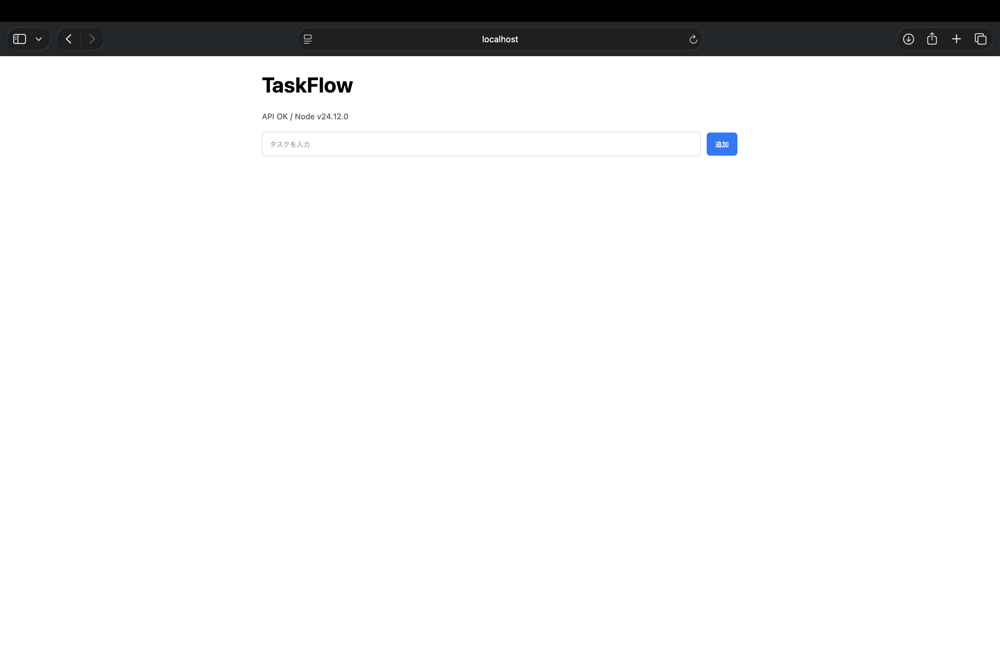

# TaskFlow




Node.js（標準モジュール）だけで動くタスク管理の最小アプリ。

## 目次
- Features（できること）
- Requirements（必要環境）
- Setup（準備）
- Run（起動）
- Data（データ保存）
- API（仕様）
- Troubleshooting（よくある問題）

## Features（できること）
- タスク：追加 / 一覧 / 完了切替 / 削除
- 永続化：JSONファイル（`data/tasks.json`）

## Requirements（必要環境）
- Node.js v24.12.0 (LTS)
- npm

## Setup（準備）
```bash
npm install
